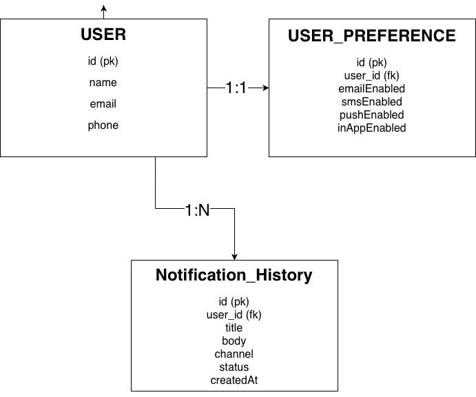
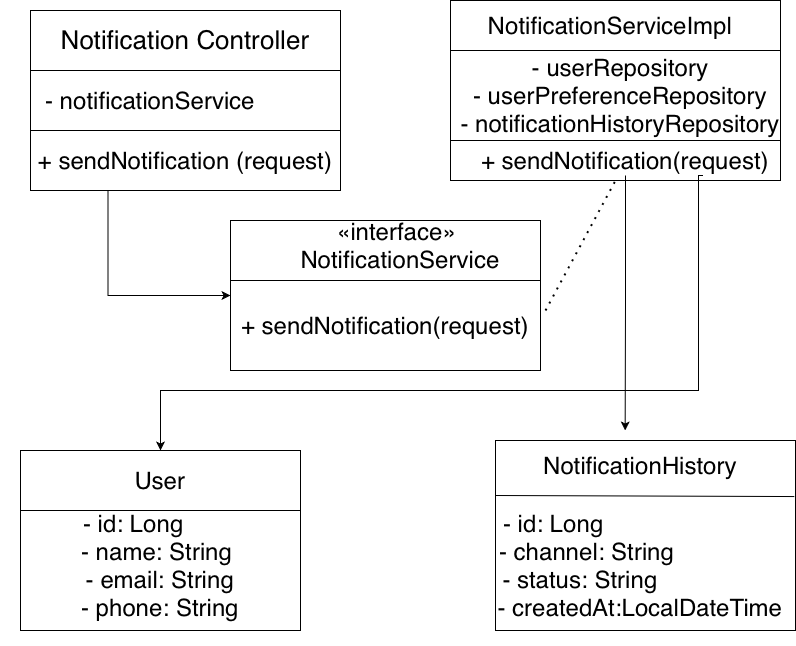

# Backend Notification System

## Description
A unified backend service for routing notifications 
to multiple channels (Email, SMS, Push, In-App).

## Setup
1. Create database:
CREATE DATABASE notificationdb;

2. Update application.properties with your MySQL password

3. Run:
mvn spring-boot:run

## API Usage

POST http://localhost:8080/notifications/send

{
  "userId": 1,
  "title": "Hello",
  "body": "Test notification",
  "channels": ["EMAIL", "SMS", "PUSH", "IN_APP"]
}

## Test Data (MySQL)
INSERT INTO user (name, email, phone) 
VALUES ('Test User', 'test@gmail.com', '9999999999');

INSERT INTO user_preference 
(email_enabled, sms_enabled, push_enabled, in_app_enabled, user_id) 
VALUES (true, true, false, true, 1);

## ER Diagram

## Class Diagram

